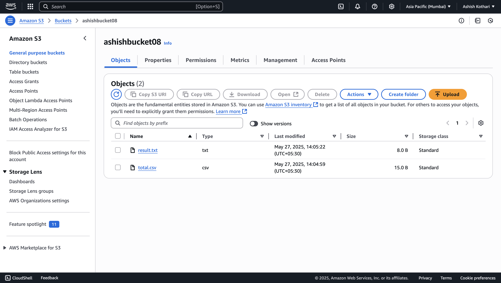
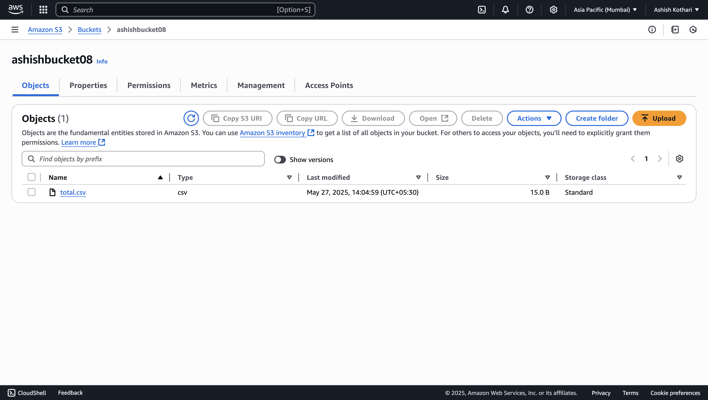
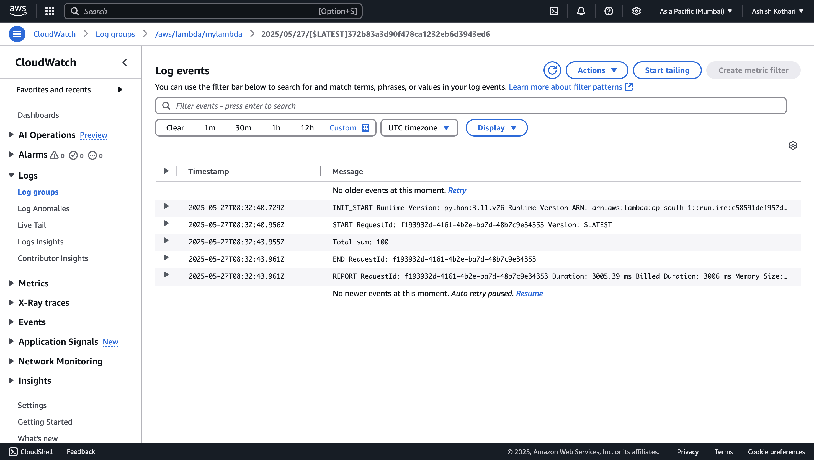
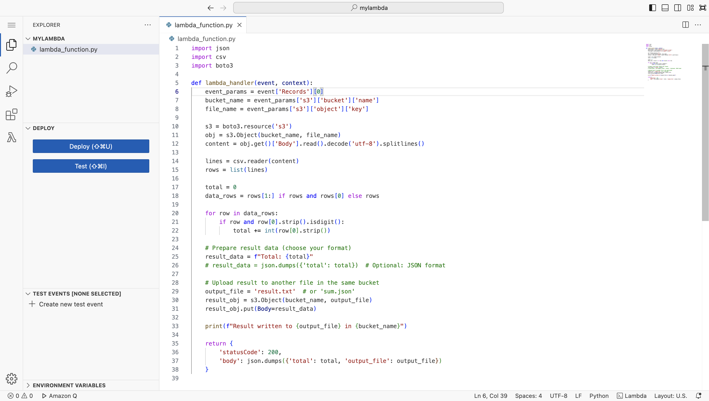

# Day 18 – AWS Lambda, S3 Triggers, and RDS

## 🧩 What is AWS Lambda?

AWS Lambda is a serverless compute service that lets you run code without provisioning or managing servers. You simply upload your code and Lambda takes care of everything required to run and scale it.

- It runs in response to events like changes to data in an Amazon S3 bucket or updates to a DynamoDB table.
- You are charged only for the compute time you consume.



---

## ⚙️ Use Case – Lambda Trigger from S3

We were shown a practical example where uploading a file to an S3 bucket automatically triggered a Lambda function which printed a message `"Hi Hello"` to the logs.

This demonstrates **event-driven architecture** where S3 events trigger AWS Lambda functions.



---

## 🧪 Task – Calculate Total from CSV on Upload

We were given a task:
- When a CSV file is uploaded to the S3 bucket,
- A Lambda function should be triggered automatically,
- It should read the file, calculate the **sum of all numeric values** in it,
- Then write the total to a new file `result.txt`,
- Finally, upload `result.txt` back to the same bucket.

### Lambda Function Code:

```python
import json
import csv
import boto3

def lambda_handler(event, context):
    event_params = event['Records'][0]
    bucket_name = event_params['s3']['bucket']['name']
    file_name = event_params['s3']['object']['key']

    s3 = boto3.resource('s3')
    obj = s3.Object(bucket_name, file_name)
    content = obj.get()['Body'].read().decode('utf-8').splitlines()

    lines = csv.reader(content)
    rows = list(lines)

    total = 0
    data_rows = rows[1:] if rows and rows[0] else rows

    for row in data_rows:
        if row and row[0].strip().isdigit():
            total += int(row[0].strip())

    result_data = f"Total: {total}"
    output_file = 'result.txt'
    result_obj = s3.Object(bucket_name, output_file)
    result_obj.put(Body=result_data)

    print(f"Result written to {output_file} in {bucket_name}")

    return {
        'statusCode': 200,
        'body': json.dumps({'total': total, 'output_file': output_file})
    }
```



---

## 🗃️ AWS RDS – Relational Database Service

Next, we were introduced to **AWS RDS (Relational Database Service)**.

- It is a managed relational database service that supports various database engines like MySQL, PostgreSQL, etc.
- We learned how to **create an RDS instance**, run it in the cloud, and **connect the same database from a local machine** using client tools like MySQL Workbench or DBeaver.



---

## ✅ Summary

Today we covered:
- What is AWS Lambda and its purpose
- Triggering Lambda with S3 file uploads
- Writing a function that reads and processes CSV data
- Introduction to AWS RDS and remote database connectivity
