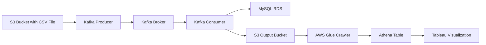
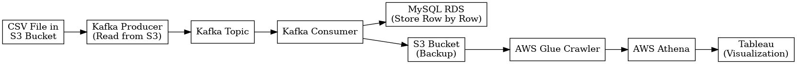

# Day 33 - Kafka ETL Pipeline Project

Today we continued our work on Kafka and began a real-time ETL pipeline project using AWS and Kafka. The project flow involved reading a CSV file from an AWS S3 bucket using a Kafka producer, streaming the data to a Kafka consumer, and then writing that data to both MySQL RDS and back to S3.

---

## 🔁 Project Flow

---

## 🛠️ Technologies & Tools Used

- **AWS S3**: Storage for raw and cleaned data.
- **Apache Kafka**: Distributed streaming platform for producer-consumer architecture.
- **MySQL RDS**: Relational database on AWS for structured data storage.
- **AWS Glue Crawler**: Automatically detects schema and creates tables in the Data Catalog.
- **AWS Athena**: Query service to analyze data in S3 using standard SQL.
- **Tableau**: Business intelligence tool used for building visual dashboards.

---

## ✅ Steps Followed

1. **Set Up AWS S3**:
   - Upload `zomato.csv` to a designated S3 bucket.

2. **Kafka Producer**:
   - Created a Python script that reads the CSV file from S3.
   - Used the Boto3 library to connect to AWS and fetch the file.
   - Sent each row as a message to a Kafka topic.

3. **Kafka Consumer**:
   - Created a separate Python consumer.
   - It reads data from the Kafka topic row by row.
   - Inserts each row into MySQL RDS.
   - Also writes each row back to a separate S3 file for backup.

4. **Glue Crawler**:
   - Configured to scan the output S3 bucket.
   - Automatically created a table in AWS Glue Data Catalog.

5. **Athena & Tableau**:
   - Queried the table using Athena.
   - Connected Tableau to Athena for live data visualization.

---

## 📊 Output

- Live streaming of restaurant data.
- Real-time insertion into MySQL.
- Visualizations built on top of Athena queries.

---

## 🖼️ Architecture Diagram

